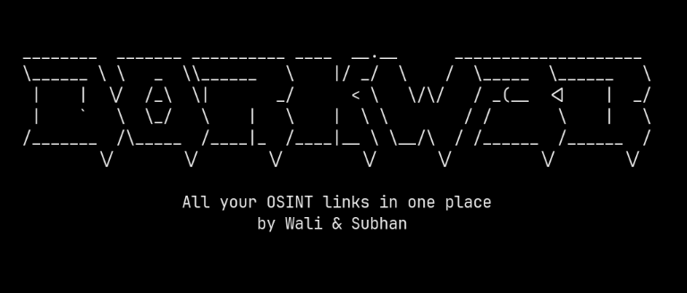
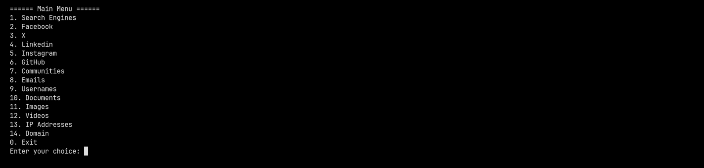
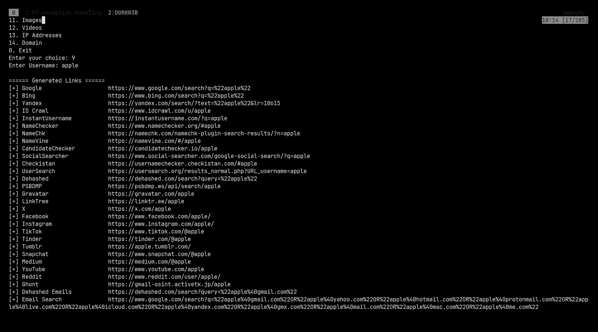
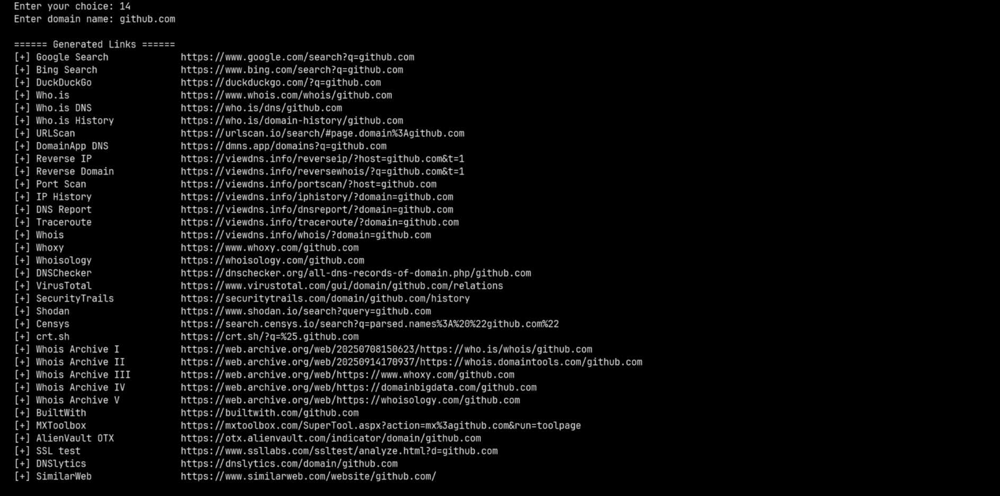
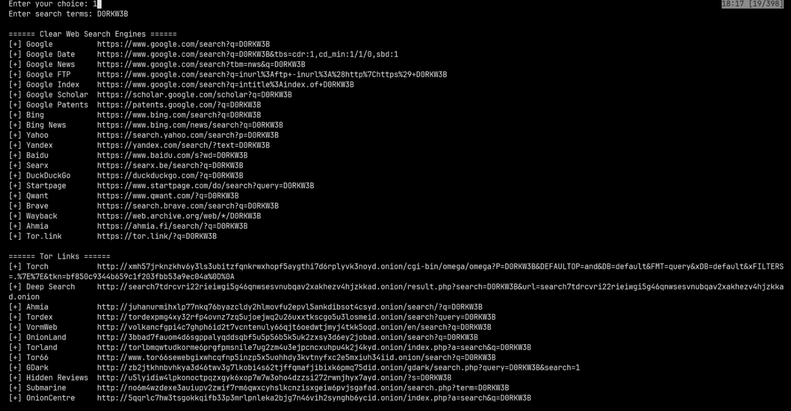

<div align="center">

# d0rkw3b


A Python-based OSINT link aggregator that generates targeted investigation URLs across search engines, social platforms, dark web indexes, and specialized lookup tools — all from a single input.



</div>

---

## Overview

**d0rkw3b** is a modular open-source intelligence (OSINT) tool designed for researchers, ethical hackers, and cybersecurity students. Given a target input — a username, email, IP address, domain, or social media handle — it instantly generates a comprehensive set of pre-built investigative links across dozens of platforms and search engines, including Tor-based dark web indexes.

It does not scrape, store, or transmit any data. All generated links are opened by the user in their own browser.

---

## Features

| Module | Input | Platforms Covered |
|---|---|---|
| `usernames.py` | Username | Google, Bing, IDCrawl, Sherlock-style checks, social platforms |
| `emailaddresses.py` | Email address | Have I Been Pwned, Dehashed, GHunt, Hunter.io, breach databases |
| `ipaddresses.py` | IP address | Shodan, Censys, AbuseIPDB, VirusTotal, Whois, geolocation |
| `domain.py` | Domain | DNS records, WHOIS, SSL info, Wayback Machine, subdomain enumeration |
| `facebook.py` | Facebook username/ID | Profile, posts, photos, search operators |
| `instagram.py` | Instagram username | Profile, posts, tagged, story highlights |
| `linkedin.py` | LinkedIn username | Profile, Google dorks, cached versions |
| `x.py` | X/Twitter username | Tweets by year, media, followers, Wayback archives |
| `github.py` | GitHub username | Repos, gists, stars, contributions |
| `images.py` | Image URL | Reverse image search across Google, Bing, Yandex, TinEye |
| `videos.py` | YouTube video ID | Thumbnails, metadata, restrictions, archives |
| `documents.py` | Search term | Google dorks for PDFs, DOCX, XLSX, PPTX |
| `communities.py` | Search term | Reddit, Discord, Telegram, forums |
| `search_links.py` | Search term | 15+ search engines including Tor indexes |

---

## Screenshots

**Main Menu**


**Username Lookup**


**Domain Investigation**


**Search Engine Dorks**


---

## Getting Started

**1. Clone the repository**
```bash
git clone https://github.com/muhammadwali0/d0rkw3b.git
cd d0rkw3b
```

**2. Run**
```bash
python main.py
```

No external dependencies required — uses Python standard library only.

---

## Project Structure

```
d0rkw3b/
├── main.py             # Entry point and menu
├── usernames.py        # Username OSINT links
├── emailaddresses.py   # Email OSINT links
├── ipaddresses.py      # IP address investigation links
├── domain.py           # Domain & DNS investigation links
├── facebook.py         # Facebook OSINT links
├── instagram.py        # Instagram OSINT links
├── linkedin.py         # LinkedIn OSINT links
├── x.py                # X / Twitter OSINT links
├── github.py           # GitHub OSINT links
├── images.py           # Reverse image search links
├── videos.py           # YouTube video investigation links
├── documents.py        # Document dork links
├── communities.py      # Community & forum search links
├── search_links.py     # Multi-engine search + Tor indexes
└── README.md
```

---

## Ethical Use

This tool generates links to publicly accessible resources only. It does not exploit any vulnerabilities, bypass authentication, or access private data.

**Use only on targets you have explicit permission to investigate.**
Unauthorized use of OSINT tools against individuals may violate privacy laws depending on your jurisdiction.

---

## License

Distributed under the [MIT License](LICENSE).

---

<div align="center">
Built for cybersecurity research, ethical hacking education, and open-source intelligence training.<br>
<strong>Always get permission. Always act ethically.</strong>
</div>
